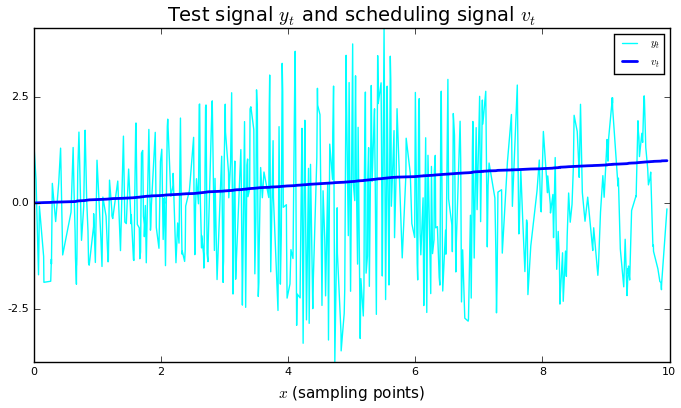
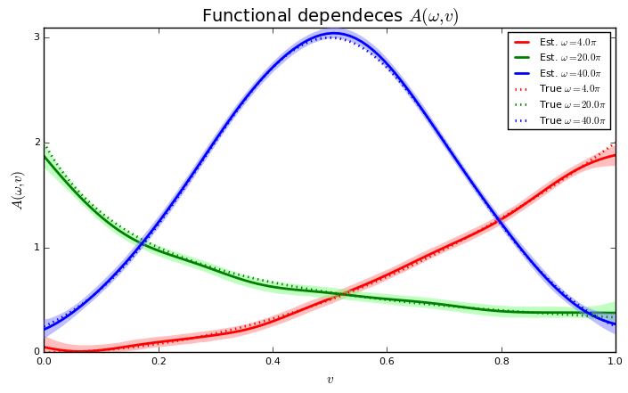
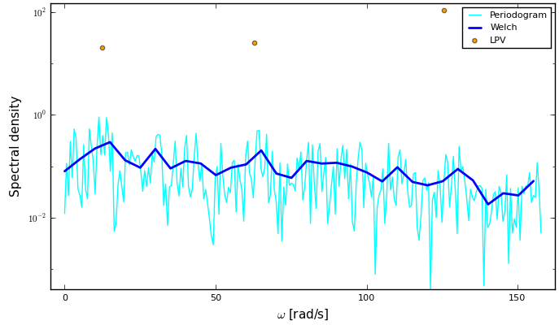

# LPVSpectral
[](https://travis-ci.org/baggepinnen/LPVSpectral.jl)

A toolbox for least-squares spectral estimation, sparse spectral estimation and Linear Parameter-Varying (LPV) spectral estimation. Contains an implementation of the spectral estimation method presented in
[Bagge Carlson et al. "Linear Parameter-Varying Spectral Decomposition." 2017 American Control Conference.](http://lup.lub.lu.se/record/ac32368e-e199-44ff-b76a-36668ac7d595)
```bibtex
@inproceedings{bagge2017spectral,
  title        = {Linear Parameter-Varying Spectral Decomposition},
  author       = {Bagge Carlson, Fredrik and Robertsson, Anders and Johansson, Rolf},
  booktitle    = {2017 American Control Conference (ACC)},
  year         = {2017},
}
```
Extensions (sparse estimation methods) to the above article were developed in
[Bagge Carlson, F.](https://www.control.lth.se/staff/fredrik-bagge-carlson/), ["Machine Learning and System Identification for Estimation in Physical Systems"](https://lup.lub.lu.se/search/publication/ffb8dc85-ce12-4f75-8f2b-0881e492f6c0) (PhD Thesis 2018).
```bibtex
@thesis{bagge2018,
  title        = {Machine Learning and System Identification for Estimation in Physical Systems},
  author       = {Bagge Carlson, Fredrik},
  keyword      = {Machine Learning,System Identification,Robotics,Spectral estimation,Calibration,State estimation},
  month        = {12},
  type         = {PhD Thesis},
  number       = {TFRT-1122},
  institution  = {Dept. Automatic Control, Lund University, Sweden},
  year         = {2018},
  url          = {https://lup.lub.lu.se/search/publication/ffb8dc85-ce12-4f75-8f2b-0881e492f6c0},
}
```

# Installation
`Pkg.add("LPVSpectral")`

For the latest changes, `Pkg.checkout("LPVSpectral")`

# Usage
We demonstrate the usage of the package with a simple example using simulated data, details can be found in the paper.

## Signal generation
```julia
using LPVSpectral, Plots, LaTeXStrings, DSP

"""
`y,v,x = generate_signal(f,w,N)`

`f` is a vector of functions `f(v)` that determine the functional dependence of the spectrum upon the velocity, one function for each frequency in `w`  both the amplitude and the phase are determined from these functions

`w` is a vector of frequencies for which to estimate the spectrum

`y,v,x` are output signal, sample points and scheduling variable respectively
"""
function generate_signal(f,w,N, modphase=false)
    x = sort(10rand(N)) # Sample points
    v = range(0, stop=1, length=N) # Scheduling variable

    # generate output signal
    dependence_matrix = Float64[f[(i-1)%length(f)+1](v) for v in v, i in eachindex(w)] # N x nw
    frequency_matrix  = [cos(w*x -0.5modphase*(dependence_matrix[i,j])) for (i,x) in enumerate(x), (j,w) in enumerate(w)] # N x nw
    y = sum(dependence_matrix.*frequency_matrix,dims=2)[:] # Sum over all frequencies
    y += 0.1randn(size(y))
    y,v,x,frequency_matrix, dependence_matrix
end

N      = 500 # Number of training data points
f      = [v->2v^2, v->2/(5v+1), v->3exp(-10*(v-0.5)^2),] # Functional dependences on the scheduling variable
w      = 2π.*[2,10,20] # Frequency vector
w_test = 2π.*(2:2:25) # Test Frequency vector, set w_test = w for a nice function visualization

Y,V,X,frequency_matrix, dependence_matrix = generate_signal(f,w,N, true)
```

## Signal analysis
We now make use of the spectral estimation method presented in the paper:
```julia
# Options for spectral estimation
λ      = 0.02 # Regularization parameter
λs     = 1    # Regularization parameter group-lasso
normal = true # Use normalized basis functions
Nv     = 50   # Number of basis functions

se  = ls_spectral_lpv(Y,X,V,w_test,Nv; λ = λ, normalize = normal) # Perform LPV spectral estimation
ses = ls_sparse_spectral_lpv(Y,X,V,w_test,Nv; λ = λs, normalize = normal, tol=1e-8, printerval=100, iters=6000) # Same as above but with a group-lasso penalty on frequencies, promoting a solution with a sparse set of frequencies. Can be used to identify a sparse spectrum, i.e. to find w among w_test.
```

All that remains now is to visualize the result, along with the result of standard spectral estimation methods.

```julia
plot(X,[Y V], linewidth=[1 2], lab=["\$y_t\$" "\$v_t\$"], xlabel=L"$x$ (sampling points)", title=L"Test signal $y_t$ and scheduling signal $v_t$", legend=true, xlims=(0,10), grid=false, c=[:cyan :blue])
plot(se; normalization=:none, dims=2, l=:solid, c = [:red :green :blue], fillalpha=0.5, nMC = 5000, fillcolor=[RGBA(1,.5,.5,.5) RGBA(.5,1,.5,.5) RGBA(.5,.5,1,.5)], linewidth=2, bounds=true, lab=reshape(["Est. \$\\omega = $(round(w/π))\\pi \$" for w in w_test],1,:), phase = false)
plot!(V,dependence_matrix, title=L"Functional dependencies $A(\omega,v)$", xlabel=L"$v$", ylabel=L"$A(\omega,v)$", c = [:red :green :blue], l=:dot, linewidth=2,lab=reshape(["True \$\\omega = $(round(w/π))\\pi\$" for w in w],1,:), grid=false)

# Plot regular spectrum
spectrum_lpv   = psd(se) # Calculate power spectral density
spectrum_lpvs  = psd(ses) # Calculate sparse power spectral density
fs             = N/(X[end]-X[1]) # This is the (approximate) sampling freqency of the generated signal
spectrum_per   = DSP.periodogram(Y, fs=fs)
spectrum_welch = DSP.welch_pgram(Y, fs=fs)
plot(2π*collect(spectrum_per.freq), spectrum_per.power, lab="Periodogram", l=:path, m=:none, yscale=:log10, c=:cyan)
plot!(2π*collect(spectrum_welch.freq), spectrum_welch.power, lab="Welch", l=:path, m=:none, yscale=:log10, linewidth=2, c=:blue)
plot!(w_test,spectrum_lpv/fs, xlabel=L"$\omega$ [rad/s]", ylabel="Spectral density", ylims=(-Inf,Inf), grid=false, lab="LPV", l=:scatter, m=:o, yscale=:log10, c=:orange)
plot!(w_test,spectrum_lpvs/fs, lab="Sparse LPV", l=:scatter, m=:o, c=:green)
```





When the three frequencies in w have been identified, `w_test` can be replaced by `w` for a nicer plot. As indicated by the last figure, the sparse estimate using group-lasso is better at identifying the three frequency components present (with a small bias in the estimation of the true frequencies).

# Sparse spectral estimation
## L₁ regularized spectral estimation
Minimize ||y-Ax||₂² + λ||x||₁ where x are the Fourier coefficients. Promotes a sparse spectrum
`x = ls_sparse_spectral(y,t,ω; proxg=NormL1(λ), tol=1e-9, printerval=100, iters=30000, μ=0.000001)`

## L₀ regularized spectral estimation
Minimize ||y-Ax||₂² + λ||x||₀ where x are the Fourier coefficients. Promotes a sparse spectrum
`x = ls_sparse_spectral(y,t,ω; tol=1e-9, printerval=100, iters=30000, μ=0.000001)`

## L₀ constrained spectral estimation
Minimize ||y-Ax||₂² s.t. ||x||₀ ≦ r where x are the Fourier coefficients. Promotes a sparse spectrum
`x = ls_sparse_spectral(y,t,ω; proxg=IndBallL0(r), tol=1e-9, printerval=100, iters=30000, μ=0.000001)`

## Sparse LPV spectral estimation
See example above
`se = ls_sparse_spectral_lpv(Y,X,V,ω_test,Nv; λ = 0.1, normalize = normal, tol=1e-8, printerval=10, iters=6000)`

# List of functions

This package also provides tools for general least-squares spectral analysis, check out the functions
```
ls_spectral             # Least-squares spectral analysis
ls_sparse_spectral      # Least-squares sparse (L0) spectral analysis (uses ADMM)
tls_spectral            # Total Least-squares spectral analysis
ls_windowpsd            # Windowed Least-squares spectral analysis (sparse estimates available, see kwarg `estimator`)
ls_windowcsd            # Windowed Least-squares cross-spectral density estimation (sparse estimates available, see kwarg `estimator`)
ls_cohere               # Least-squares cross coherence estimation (sparse estimates available, see kwarg `estimator`)
ls_spectral_lpv         # LPV spectral decomposition
ls_sparse_spectral_lpv  # LPV spectral decomposition with group-lasso penalty on frequencies (uses ADMM)
ls_windowpsd_lpv        # Windowed power spectral density estimation with LPV method
```
